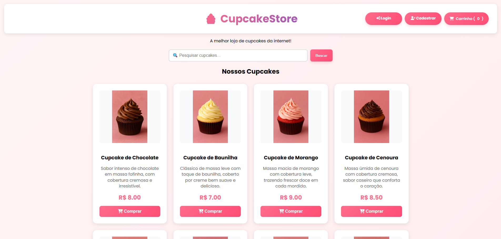
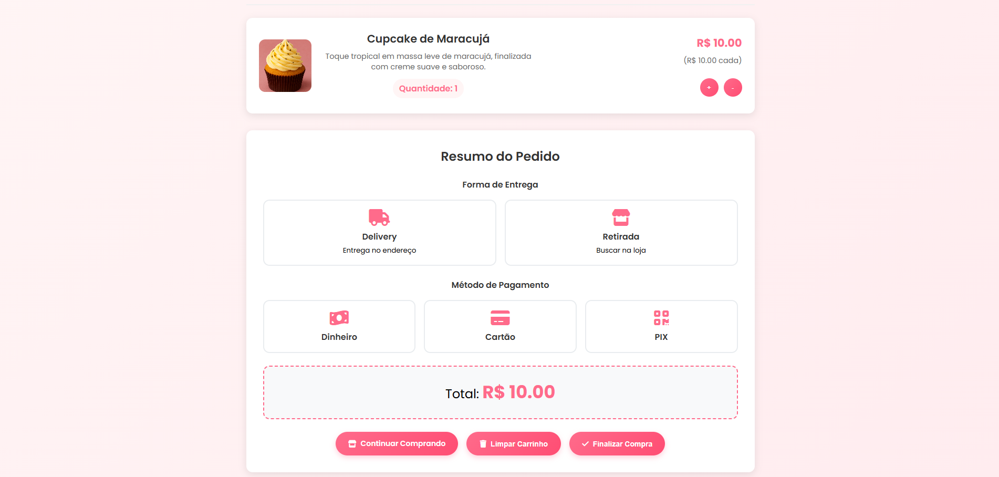
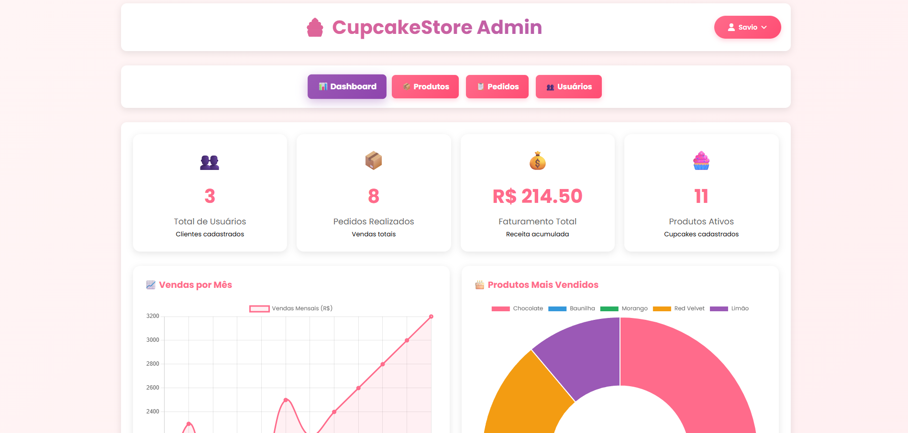
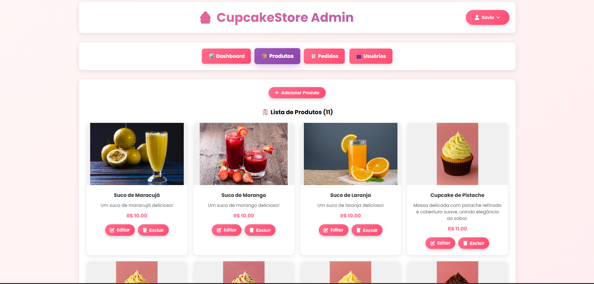

# Cupcake Store 🧁

Projeto Integrador Transdisciplinar em Engenharia de Software - UNICID - Cruzeiro Sul Virtual

_Este é um projeto completo de e-commerce para uma loja de cupcakes, desenvolvido como parte do trabalho acadêmico. O sistema inclui loja virtual, carrinho de compras, painel administrativo e gestão completa de pedidos. Tenha em mente que este é um projeto acadêmico e não atende aos requisitos para ser utilizado em produção._

#### 🔧 Sinta-se à vontade para contribuir com o código 🔧

## Como rodar o projeto *local*?

### Pré-requisitos
- Python 3.8 ou superior
- Git

### Passos para execução

1. **Clone o repositório:**
~~~sh
git clone https://github.com/SavioSalesSantos/CupcakeStore.git
~~~

2. **Navegue até a pasta do projeto:**
~~~sh
cd cupcake-store
~~~

3. **Crie e ative um ambiente virtual (recomendado):**
~~~sh
# Windows
python -m venv venv
venv\Scripts\activate

# Linux/Mac
python3 -m venv venv
source venv/bin/activate
~~~

4. **Instale as dependências:**
~~~sh
pip install -r requirements.txt
~~~

5. **Execute a aplicação:**
~~~sh
python backend/app.py
~~~

6. **Acesse a aplicação no navegador:**
~~~
http://localhost:5000
~~~

### Dados de Acesso para Teste

**Conta Administrativa:**
- Email: `admin@cupcakestore.com`
- Senha: `admin123`

**Conta de Cliente:**
- Email: `teste@email.com`
- Senha: `teste123`

### Informações Adicionais

- **Linguagem Back-end**: Python (Flask)
- **Front-end**: HTML5, CSS3, JavaScript (Vanilla)
- **Banco de Dados**: SQLite3
- **Framework Web**: Flask
- **Autenticação**: Sessions com Flask
- **Upload de Imagens**: Suporte a PNG, JPG, JPEG, GIF, WEBP
- **Plataforma**: Web (totalmente responsivo para mobile, tablet e desktop)

### Estrutura do Projeto

A estrutura do projeto é organizada da seguinte forma:

- `backend/`: 
  - `app.py` - *Aplicação principal Flask com todas as rotas*
  - `controller.py` - *Controladores e lógica de negócio*
- `database/`: 
  - `database.py` - *Configuração e inicialização do banco de dados*
  - `cupcakes.db` - *Banco de dados SQLite (gerado automaticamente)*
- `frontend/`: 
  - `templates/` - *Templates HTML (Jinja2)*
    - `Admin/` - *Painel administrativo*
    - `*.html` - *Páginas da loja*
  - `static/` - *Arquivos estáticos*
    - `css/` - *Estilos CSS*
    - `js/` - *JavaScript client-side*
    - `uploads/` - *Imagens dos produtos*
    - `sounds/` - *Efeitos sonoros*
- `docs/`: *Documentação do projeto*
- `venv/`: *Ambiente virtual Python*

### Funcionalidades Principais

#### 🛍️ Loja Virtual
- Catálogo de produtos com paginação
- Busca em tempo real
- Carrinho de compras interativo
- Múltiplas formas de pagamento (Cartão, Dinheiro, PIX)
- Opções de entrega (Delivery e Retirada)
- Histórico de pedidos

#### 👤 Área do Cliente
- Cadastro e login de usuários
- Gestão de dados pessoais
- Endereço de entrega com busca por CEP
- Histórico de pedidos
- Acompanhamento de status

#### ⚙️ Painel Administrativo
- Dashboard com métricas e gráficos
- Gestão completa de produtos (CRUD)
- Gerenciamento de pedidos e status
- Controle de usuários
- Estatísticas de vendas
- Upload de imagens para produtos

### Tecnologias Utilizadas

- **Back-end**: Python, Flask, SQLite3, Werkzeug
- **Front-end**: HTML5, CSS3, JavaScript (ES6+)
- **Banco de Dados**: SQLite3 com ORM nativo
- **Segurança**: Hash de senhas com Werkzeug
- **Uploads**: Processamento de imagens com Pillow
- **UI/UX**: Font Awesome, Google Fonts (Poppins)
- **Responsividade**: CSS Grid e Flexbox

### Autoria

Este projeto foi desenvolvido por [Savio](https://github.com/SavioSalesSantos) como parte do Projeto Integrador Transdisciplinar em Engenharia de Software - UNICID - Cruzeiro Sul Virtual.

Para mais informações, consulte a [documentação](docs).

## Capturas de Tela

- **Loja Principal:**
  

- **Carrinho de Compras:**
  

- **Painel Administrativo:**
  

- **Gestão de Produtos:**
  

### Desenvolvimento

Para contribuir com o projeto:

1. Faça um fork do repositório
2. Crie uma branch para sua feature (`git checkout -b feature/AmazingFeature`)
3. Commit suas mudanças (`git commit -m 'Add some AmazingFeature'`)
4. Push para a branch (`git push origin feature/AmazingFeature`)
5. Abra um Pull Request

### Licença

Este projeto é destinado exclusivamente para fins acadêmicos.

---

**Nota**: Este projeto está em constante desenvolvimento e melhorias. Sugestões são sempre bem-vindas! 🚀