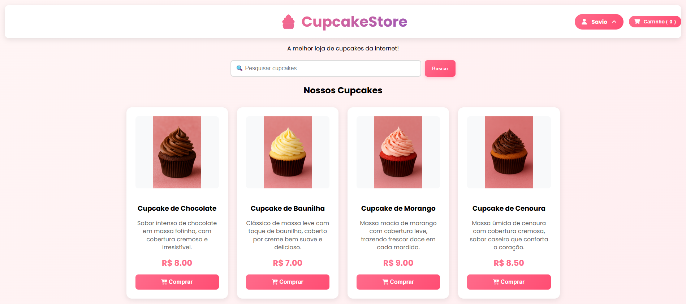
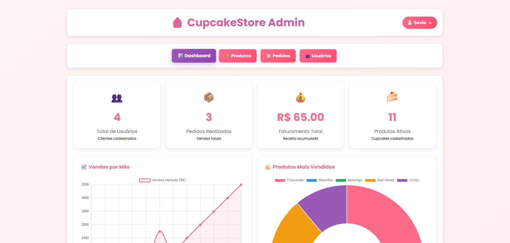
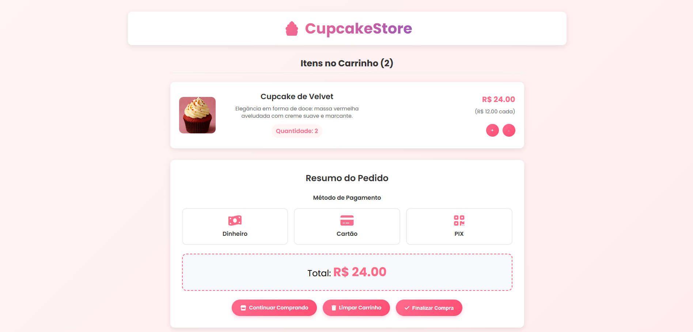

# **🧁 Cupcake Store**

**Um protótipo de e-commerce para uma loja de cupcakes, desenvolvido como trabalho acadêmico para a disciplina de Projeto Integrador Transdisciplinar II do curso de Engenharia de Software da UNICID - Cruzeiro Sul Virtual**

**⚠️ Esse é um projeto que funcionará como uma loja online de cupcakes para uma pequena empresa. Ele faz parte de um trabalho acadêmico e utiliza conceitos aprendidos durante o curso. Tenha em mente que este é um projeto acadêmico e não atende aos requisitos para ser utilizado em produção

Funcionalidades Principais
Catálogo de Produtos: Visualização de cupcakes com imagens, descrições e preços

Sistema de Carrinho: Adição, remoção e gestão de itens no carrinho de compras

Autenticação de Usuários: Registro, login e gestão de perfis

Painel Administrativo: CRUD completo de produtos, usuários e pedidos

Sistema de Pedidos: Histórico de compras e status de pedidos

Design Responsivo: Interface adaptada para mobile, tablet e desktop

Tecnologias Utilizadas
Back-end
Python 3.8+: Linguagem de programação principal

Flask: Framework web lightweight

SQLite: Banco de dados relacional

SQLAlchemy: ORM para gestão do banco de dados

Werkzeug: Utilidades para segurança (hash de senhas)

Front-end
HTML5: Estrutura das páginas

CSS3: Estilização com design responsivo

JavaScript: Interatividade e funcionalidades dinâmicas

Font Awesome: Ícones

Google Fonts (Poppins): Tipografia

Estrutura do Projeto
cupcakestore/
├── backend/
│   ├── app.py                 # Aplicação principal Flask
│   ├── controller.py          # Controladores adicionais
│  
├── database/
│   ├── database.py            # Configuração e modelos do banco
│   ├── cupcakes.db            # Banco de dados SQLite (gerado)
│ 
├── frontend/
│   ├── static/
│   │   ├── css/
│   │   │   └── style.css      # Estilos principais
│   │   │
│   │   ├── js/
│   │   │   ├── script.js      # JavaScript geral
│   │   │   └── carrinho.js    # Funcionalidades do carrinho
│   │   │ 
│   │   ├── sounds/            # Efeitos sonoros
│   │   └── uploads/           # Imagens enviadas
│   │
│   └── templates/
│       ├── admin/             # Painel administrativo
│       │   ├── dashboard.html # Visão geral  
│       │   ├── produtos.html # Gerenciamento de produtos 
│       │   ├── pedidos.html # Gerenciamento de pedidos
│       │   ├── usuarios.html # Gerenciamento de usuários
│       │   ├── editar_produto.html # Edição de produtos 
│       │   └── editar_usuario.html # Edição de usuários
│       │ 
│       ├── index.html         # Página inicial
│       ├── login.html         # Autenticação
│       ├── register.html      # Registro
│       ├── carrinho.html      # Carrinho de compras
│       ├── compra_finalizada.html # Confirmação de compras
│       ├── meu_usuario.html   # Perfil do usuário
│       └── meus_pedidos.html  # Histórico de pedidos
│ 
├── docs/                      # Documentação
└── README.md                  # Este arquivo

Capturas de Tela
Página Principal

Painel Administrativo

Carrinho de Compras

Como Executar o Projeto Localmente
Pré-requisitos
Python 3.8+

pip (gerenciador de pacotes do Python)

SQLite (já incluído no Python)

Passo a Passo
Clone o repositório:

bash
git clone https://github.com/seu-usuario/cupcakestore.git
cd cupcakestore

Execute a aplicação:
bash
python backend/app.py
Acesse a aplicação:
Abra seu navegador e visite: http://localhost:5000

 Credenciais de Demonstração
Conta Administrativa
Email: admin@cupcakestore.com

Senha: admin123

Conta de Usuário Comum
Email: teste@email.com

Senha: teste123

Autoria
Este projeto foi desenvolvido como parte do Projeto Integrador Transdisciplinar em Engenharia de Software II da UNICID - Cruzeiro Sul Virtual.

Desenvolvedor: [Savio Sales Santos]
Email: [savio.s11@gmail.com]
GitHub: [https://github.com/SavioSalesSantos]
